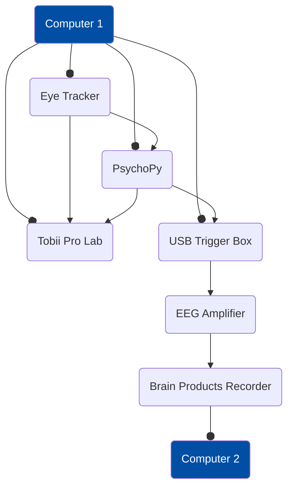

# EEG Demo Experiment

EEG Demo Experiment running in PsychoPy (for stimulu presentation), Tobii Pro Lab (to record eye tracking data and analyse it), and Brain Producs Recorder and Analyser (to record and analyse EEG data).

This sample experiment is a recreation of the Tobii visual search sample project. You can find the project and the walktrough of the experiment [here](https://connect.tobii.com/s/demo-project-visual-search-walk-through?language=en_US)

## Setup



## Requirements

This script was tested using:

- PsychoPy version 2024.1.1
- Tobii Pro Lab version 1.241
- TriggerBox Software 2.0.3

## Step by step

1. Install Tobii Eye Tracker Manager
Link to download: https://connect.tobii.com/s/etm-downloads?language=en_US
2. Create a screen profile
See more information in this support article: https://connect.tobii.com/s/article/How-can-I-install-and-configure-my-screen-based-eye-tracker?language=en_US
3. Install the TriggerBox software:
Link to download: https://www.brainproducts.com/downloads/more-software/#triggerbox-software
4. Install Tobii Pro Lab and activate it with a valid license.
 Link to Download: https://connect.tobii.com/s/lab-downloads?language=en_US
5. Download the repository.
6. Open Psycopy Builder.
7. Install Titta in PsychoPy:
    Go to “Components” + Get more…
    or
    Tools - Plugin/packages manager…
    On the Packages tab, search for titta and install.
    or
    Open the Pip terminal and type:

    ```bash
    pip install titta
    ```

8. Program your experiment in Builder.
9. Add the code components for the Tobii Pro Lab connection (See code components below).
10. Add the code components for the EEG triggers (See code components below).
11. Create a new Tobii Pro Lab project in Third-Party presenter. Note that you need to have Tobii Pro Lab Screen-Based One Edition or Full Edition.
12. Move to the record tab and make sure the eye tracker is selected.
13. Go back to PsychoPy and press run.
14. Add a unique participant number that has not been sent to Pro Lab yet.
15. Record the experiment. If calibration with PsychoPy or the Titta Toolbox is enabled remember to press space to start it.
16. When the recording is done, go back to Pro Lab and save the recording.
17. Close PsychoPy and go to Pro Lab.
18. You can now replay the recording by double clicking on the participant name you just recorded.
19. You can add different data visualizations to the timeline, you can visualize the raw data, visualize pupil size, eye openness, blinks and others. Certain data streams may not be active if your recording was done with an eye tracker that is not compatible with that specific data stream. IE: if you record with a Tobii Pro Fusion at 250Hz you won't be able to get eye openness and blinks.
20. Change to the Visualization tool by going to Analyze -> Visualizations. You can play arround with different visualization typs that use the images we uploaded to Tobii Pro Lab using PsychoPy.
21. You can switch to the AOI tool by going back to Analyze -> AOI Tool. If you added areas of interest in the code components you will see them already created there. If you didn't you can add them now.
22. You can add tags to the AOI to merge the data from them in meaningul groups. The AOI tags will be shared between different images which will allow you to aggregate AOIs that are present in multiple of our stimuli.
23. You can swith to Metrics Visualisation by going back to Analyze -> Metric Visualization
24. In order for the graph to display data, you need to select a custom TOI. To create one, select the plus button and select a start and end event. This can be all the automatically created start of stimuli presentation and end of stimuli presentation. As this is a visual search experiment, the two relevant metrics are Interval Duraiton, which gives us the response time, and time to first fixation, which gives us the time they took to look at it for the first time. If you select one of them on the left hand side panel you should see a graph display.
25. In order to export the metric represented on the graph, you can click the export button on the top of the grpah or you can go back to Analyze -> Metrics Export and select the relevant metrics and export options you want there.

## Source code for the Titta Toolbox

https://github.com/marcus-nystrom/Titta/tree/master

## Code Component to Talk to Pro Lab

Those are the different code snippets that you need to add to the Builder as a code element if you want your experiment to be recorded in Tobii Pro Lab.

### Before experiment tab

This code snippet take care of the general information needed for the connection with the eye tracker and with Tobii Pro Lab. Note that you need to change the code in ET Settings to coment and uncomment the name of the eye tracker that corresponds to the one you are using.

```python
from titta import Titta, helpers_tobii as helpers
from titta.TalkToProLab import TalkToProLab
from psychoPy import monitors
import re

#%% ET settings
# et_name = 'Tobii Pro Spark'
et_name = 'Tobii Pro Fusion'
# et_name = 'Tobii Pro Nano'
# et_name = 'Tobii Pro Spectrum'
 
dummy_mode = False
project_name = None # None or a project name that is open in Pro Lab.
                    # If None, the currently opened project is used.
 
# Change any of the default settings?
settings = Titta.get_defaults(et_name)
 
#%% Connect to eye tracker and calibrate (you need to do this outside of lab)
tracker = Titta.Connect(settings)
if dummy_mode:
    tracker.set_dummy_mode()
tracker.init()
 
#%% Talk to Pro Lab
ttl = TalkToProLab(project_name=project_name,
                   dummy_mode=dummy_mode)
```

### Begin experiment

This code stablishes the connection with Tobii Pro Lab and calibrats the participant. You have 4 ways of callibrating the participant:

- Calibrating the participant beforehand using the Tobii Pro Eye Tracker Manager.
- Open a different Screen-Based Project in Tobii Pro Lab and callibrate the participants there.
- Callibrate activating the PsychoPy default calibration options.
- Callibrate using the Titta Callibration routin (uncoment the necessary code below to perform calibration this way).

```python
settings.FILENAME = expInfo['participant']
 
# Participant ID and Project name for Lab
pid = settings.FILENAME

participant_info = ttl.add_participant(pid)
# Calibrate (must be done independently of Lab). You can do it either with the
# PsychoPy build-in calibration, or you can use the Titta calibration by
# uncommenting the next two lines.
# tracker.calibrate(win)
# win.flip()
 
#%% Recording
# Check that Lab is ready to start a recording
state = ttl.get_state()
assert state['state'] == 'ready', state['state']
 
## Start recording (Note: you have to click on the Record Tab first!)
rec = ttl.start_recording("image_viewing",
                    participant_info['participant_id'],
                    screen_width=1920,
                    screen_height=1080)
```

### Begin Routine

This code taks care of handeling the media you are presenting in your experument. Be careful as to change the `[:-4]` to the necessary number to substract the end of the file extension name. For instance, if the stimuli you present is a .jpg, then you need to substract 4 characters to get only the file name (3 for the letters plus one for the .).

```python
# Create PsychoPy image objects and upload media to Lab
# Make sure the images have the same resolution as the screen
im_name = images # use image path from spreadsheet, the name of the variable corresponds to the name of the column in the table
im = visual.ImageStim(win, image=im_name)

print('Searching media in Tobii Pro Lab')
prolab_list_media = ttl.list_media()['media_list']

media_id = None

# Upload media (if not already uploaded)
print('Searching media in Tobii Pro Lab')
if not ttl.find_media(im_name):
    print(f'Media "{im_name}" not found, uploading to Tobii Pro Lab')
    upload_response = ttl.upload_media(im_name, "image")
    media_id = upload_response['media_id']

# If the media were uploaded already, just get their names and IDs.
if media_id == None:
    print('Media found, organising media to match Tobii Pro Lab')
    for m in prolab_list_media:
        if im_name[:-4] == m['media_name']:
            media_id = m['media_id']
            break

t_onset = int(ttl.get_time_stamp()['timestamp'])
print('t_onset', t_onset)
```

### End Routine

Sends the onset and offset information to Tobii Pro Lab.

```python
t_offset = int(ttl.get_time_stamp()['timestamp'])
print('t_offset', t_offset)

# Send stimulus event
ttl.send_stimulus_event(rec['recording_id'],
                        str(t_onset),
                        media_id,
                        end_timestamp=str(t_offset))
```

### End Experiment

This set of instructions finalise the recordings and disconnects from Tobii Pro Lab.

```python
## Stop recording
ttl.send_message(ttl.external_presenter_address,
    {"operation": "StopRecording"})
win.close()

#%% Finalize the recording
# Finalize recording
print(rec)
print(rec['recording_id'])
ttl.send_message(ttl.external_presenter_address,
    {"operation": "FinalizeRecording",
    "recording_id": rec['recording_id']})
print('recording has been finalized')
ttl.disconnect()
```

## Code component to Setup Triggers

The current setup uses a Brain Products USB trigger box connected to the stimuli presentation computer via USB. The presentation computer sends triggers to the EEG amplifier on the onset of each stimuli.

Add another code element that contains the following code.

### Begin Experiment

```python
Import serial
port = serial.Serial(port="COM7",baudrate=2000000)
```

### Begin Routine

```python
#Mark the stimulus onset triggers as "not sent"
#at the start of the trial
stimulus_pulse_started = False
stimulus_pulse_ended = False
```

### Each Frame

```python
##STIMULUS TRIGGERS##
#Check to see if the stimulus is presented this frame
#and send the trigger if it is
if image.status == STARTED and not stimulus_pulse_started: #Change 'image' to match the name of the component that you want to send the trigger for
    win.callOnFlip(port.write, [0x01])
    stimulus_pulse_start_time = globalClock.getTime()
    stimulus_pulse_started  = True
#If it's time to end the pulse, reset the value to "0"
#so that we don't continue sending triggers on every frame
if stimulus_pulse_started and not stimulus_pulse_ended:
        if globalClock.getTime() - stimulus_pulse_start_time >= 0.05:
            win.callOnFlip(port.write, [0x00])
            stimulus_pulse_ended = True
```

## Troubleshooting

### Eye tracking name

Make sure the eye tracker name stated at the start of the code corresponds with the eye tracker you have connected to the computer. If you are not sure, you can check the name in the Eye Tracker Manager. The most current options are:
et_name = 'Tobii Pro Spark'
et_name = 'Tobii Pro Fusion'
et_name = 'Tobii Pro Nano'
et_name = 'Tobii Pro Spectrum'

### Participant number

Make sure the participant number does not already exist in Tobii Pro Lab. If the participant was created in Pro Lab but has no recording associated with it, you can delete it and use it again.

### File extension

The value of im_name[:-4] has to be changed to accommodate for the file extension you are using. If you use .png files it is a 4, but for .jpeg it will need to be 5.

### Connection debuging

Run the 'connection_debuging.py' script to determine if there is a problem connecting to Tobii Pro Lab and get as a return the information about the media stored in the current project and a list of participants.
